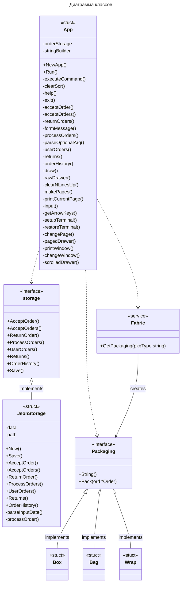
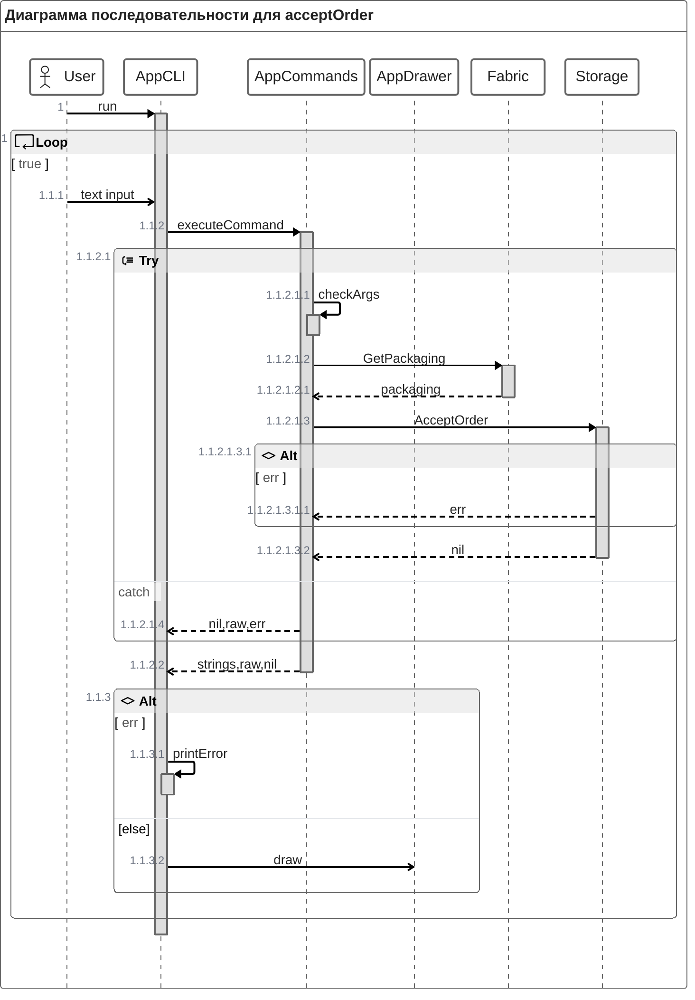

## Диаграмма классов

## Диаграмма последовательности
На самом деле класс App состоит из 3 разных слоёв: commands, cli, drawer.
Хоть они и не выделены в отдельные объекты, буду описывать взаимодействие между ними, как между разными объектами 
