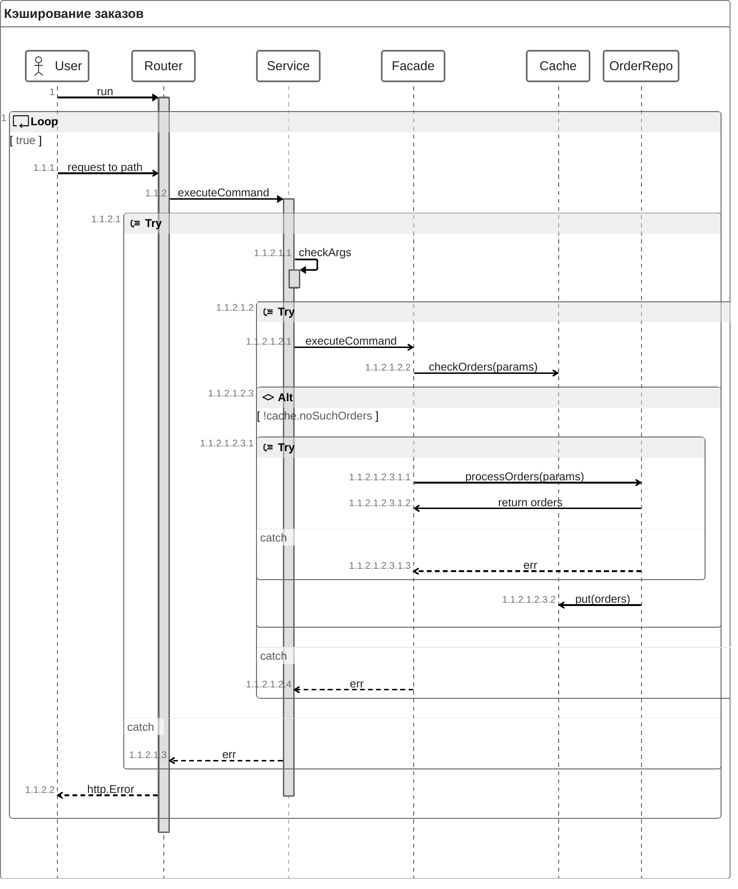

## Принцип работы кэша

Кэш реализован с помощью стратегии LRU, а в качестве паттерна я использовал фасад, в котором находится хранилище и кэш. 
В данный момент реализовано кэширование пользователей и заказов, в данной диаграмме описана работа механизма кэширования заказов. 

