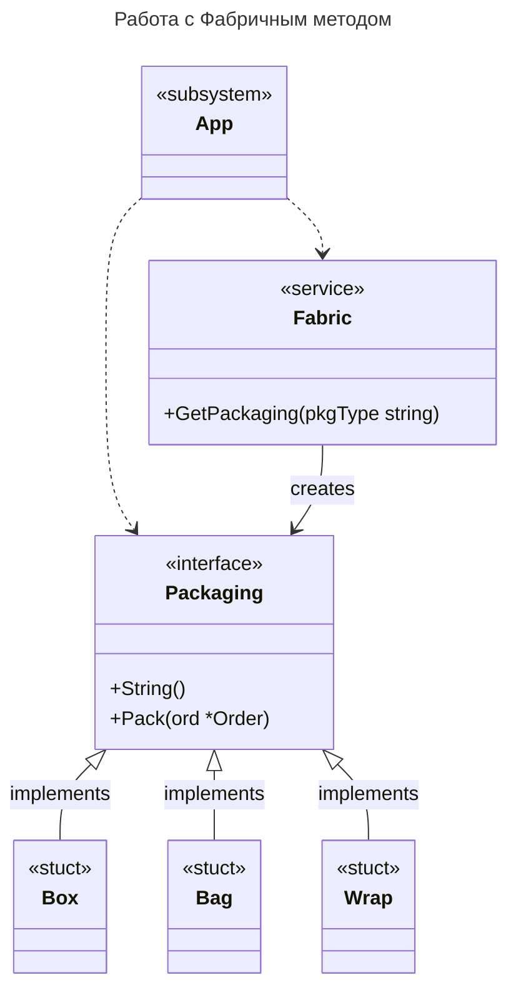

## Почему я выбрал Фабричный метод

Про Фабричный метод я прочитал тут [1].
Я сразу понял, что именно он мне и нужен, потому что:

1. Позволяет освободить моё приложение от зависимости от конкретной реализации упаковок
2. Выносит код производства упаковок в отдельное место
3. Упаковки не зависят друг от друга
4. Упрощает добавление новых упаковок, достаточно определить методы из интерфейса Packaging и добавить новый тип в фабрику

[1] https://refactoring.guru/ru/design-patterns/factory-method.